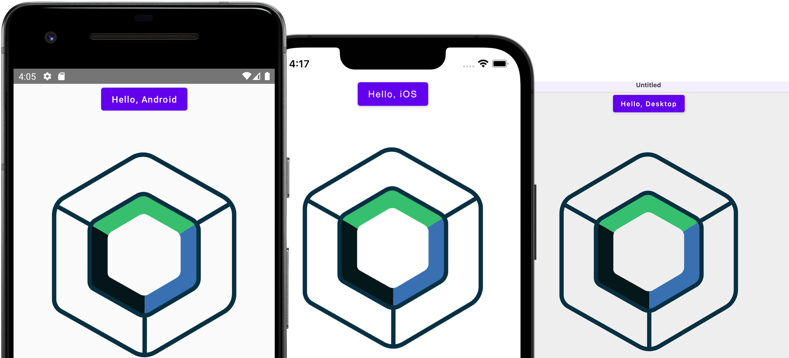

[//]: # ([![official project]&#40;http://jb.gg/badges/official.svg&#41;]&#40;https://confluence.jetbrains.com/display/ALL/JetBrains+on+GitHub&#41;)

[//]: # ()
[//]: # ([![License]&#40;https://img.shields.io/badge/License-Apache_2.0-blue.svg&#41;]&#40;https://opensource.org/licenses/Apache-2.0&#41;)

[//]: # ()
[//]: # (# [Compose Multiplatform]&#40;https://github.com/JetBrains/compose-multiplatform&#41; application)

[//]: # ()
[//]: # ()
[//]: # (> **Note**)

[//]: # ()
[//]: # (> The iOS part of Compose Multiplatform is in Alpha. It may change incompatibly and require manual migration in the)

[//]: # ()
[//]: # (> future.)

[//]: # ()
[//]: # (> If you have any issues, please report them on [GitHub]&#40;https://github.com/JetBrains/compose-multiplatform/issues&#41;.)

[//]: # ()
[//]: # ()
[//]: # (You can use this template to start developing your)

[//]: # ()
[//]: # (own [Compose Multiplatform]&#40;https://github.com/JetBrains/compose-multiplatform#readme&#41; application targeting desktop,)

[//]: # ()
[//]: # (Android, and iOS.)

[//]: # ()
[//]: # (Follow our tutorial below to get your first Compose Multiplatform app up and running.)

[//]: # ()
[//]: # (The result will be a [Kotlin Multiplatform]&#40;https://kotlinlang.org/docs/multiplatform.html&#41; project that uses the)

[//]: # ()
[//]: # (Compose Multiplatform UI framework.)

[//]: # ()
[//]: # ()
[//]: # ()

[//]: # ()
[//]: # ()
[//]: # (## Set up the environment)

[//]: # ()
[//]: # ()
[//]: # (> **Warning**)

[//]: # ()
[//]: # (> You need a Mac with macOS to write and run iOS-specific code on simulated or real devices.)

[//]: # ()
[//]: # (> This is an Apple requirement.)

[//]: # ()
[//]: # ()
[//]: # (To work with this template, you need the following:)

[//]: # ()
[//]: # ()
[//]: # (* A machine running a recent version of macOS)

[//]: # ()
[//]: # (* [Xcode]&#40;https://apps.apple.com/us/app/xcode/id497799835&#41;)

[//]: # ()
[//]: # (* [Android Studio]&#40;https://developer.android.com/studio&#41;)

[//]: # ()
[//]: # (* The [Kotlin Multiplatform Mobile plugin]&#40;https://plugins.jetbrains.com/plugin/14936-kotlin-multiplatform-mobile&#41;)

[//]: # ()
[//]: # (* The [CocoaPods dependency manager]&#40;https://kotlinlang.org/docs/native-cocoapods.html&#41;)

[//]: # ()
[//]: # ()
[//]: # (### Check your environment)

[//]: # ()
[//]: # ()
[//]: # (Before you start, use the [KDoctor]&#40;https://github.com/Kotlin/kdoctor&#41; tool to ensure that your development environment)

[//]: # ()
[//]: # (is configured correctly:)

[//]: # ()
[//]: # ()
[//]: # (1. Install KDoctor with [Homebrew]&#40;https://brew.sh/&#41;:)

[//]: # ()
[//]: # ()
[//]: # (    ```text)

[//]: # ()
[//]: # (    brew install kdoctor)

[//]: # ()
[//]: # (    ```)

[//]: # ()
[//]: # ()
[//]: # (2. Run KDoctor in your terminal:)

[//]: # ()
[//]: # ()
[//]: # (    ```text)

[//]: # ()
[//]: # (    kdoctor)

[//]: # ()
[//]: # (    ```)

[//]: # ()
[//]: # ()
[//]: # (   If everything is set up correctly, you'll see valid output:)

[//]: # ()
[//]: # ()
[//]: # (   ```text)

[//]: # ()
[//]: # (   Environment diagnose &#40;to see all details, use -v option&#41;:)

[//]: # ()
[//]: # (   [✓] Operation System)

[//]: # ()
[//]: # (   [✓] Java)

[//]: # ()
[//]: # (   [✓] Android Studio)

[//]: # ()
[//]: # (   [✓] Xcode)

[//]: # ()
[//]: # (   [✓] Cocoapods)

[//]: # ()
[//]: # (   )
[//]: # (   Conclusion:)

[//]: # ()
[//]: # (     ✓ Your system is ready for Kotlin Multiplatform Mobile development!)

[//]: # ()
[//]: # (   ```)

[//]: # ()
[//]: # ()
[//]: # (Otherwise, KDoctor will highlight which parts of your setup still need to be configured and will suggest a way to fix)

[//]: # ()
[//]: # (them.)

[//]: # ()
[//]: # ()
[//]: # (## Examine the project structure)

[//]: # ()
[//]: # ()
[//]: # (Open the project in Android Studio and switch the view from **Android** to **Project** to see all the files and targets)

[//]: # ()
[//]: # (belonging to the project:)

[//]: # ()
[//]: # ()
[//]: # ()

[//]: # ()
[//]: # ()
[//]: # (Your Compose Multiplatform project includes 4 modules:)

[//]: # ()
[//]: # ()
[//]: # (### `shared`)

[//]: # ()
[//]: # ()
[//]: # (This is a Kotlin module that contains the logic common for desktop, Android, and iOS applications, that is, the code you)

[//]: # ()
[//]: # (share between platforms.)

[//]: # ()
[//]: # ()
[//]: # (This `shared` module is also where you'll write your Compose Multiplatform code.)

[//]: # ()
[//]: # (In `shared/src/commonMain/kotlin/App.kt`, you can find the shared root `@Composable` function for your app.)

[//]: # ()
[//]: # ()
[//]: # (It uses Gradle as the build system. You can add dependencies and change settings in `shared/build.gradle.kts`.)

[//]: # ()
[//]: # (The `shared` module builds into a Java library, an Android library, and an iOS framework.)

[//]: # ()
[//]: # ()
[//]: # (### `desktopApp`)

[//]: # ()
[//]: # ()
[//]: # (This is a Kotlin module that builds into a desktop application. It uses Gradle as the build system. The `desktopApp`)

[//]: # ()
[//]: # (module depends on and uses the `shared` module as a regular library.)

[//]: # ()
[//]: # ()
[//]: # (### `androidApp`)

[//]: # ()
[//]: # ()
[//]: # (This is a Kotlin module that builds into an Android application. It uses Gradle as the build system.)

[//]: # ()
[//]: # (The `androidApp` module depends on and uses the `shared` module as a regular Android library.)

[//]: # ()
[//]: # ()
[//]: # (### `iosApp`)

[//]: # ()
[//]: # ()
[//]: # (This is an Xcode project that builds into an iOS application.)

[//]: # ()
[//]: # (It depends on and uses the `shared` module as a CocoaPods dependency.)

[//]: # ()
[//]: # ()
[//]: # (## Run your application)

[//]: # ()
[//]: # ()
[//]: # (### On desktop)

[//]: # ()
[//]: # ()
[//]: # (To run your desktop application in Android Studio, select `desktopApp` in the list of run configurations and click **Run**:)

[//]: # ()
[//]: # ()
[//]: # (<br />)

[//]: # ()
[//]: # ()
[//]: # ()

[//]: # ()
[//]: # ()
[//]: # (You can also run Gradle tasks in the terminal:)

[//]: # ()
[//]: # ()
[//]: # (* `./gradlew run` to run application)

[//]: # ()
[//]: # (* `./gradlew package` to store native distribution into `build/compose/binaries`)

[//]: # ()
[//]: # ()
[//]: # (### On Android)

[//]: # ()
[//]: # ()
[//]: # (To run your application on an Android emulator:)

[//]: # ()
[//]: # ()
[//]: # (1. Ensure you have an Android virtual device available.)

[//]: # ()
[//]: # (   Otherwise, [create one]&#40;https://developer.android.com/studio/run/managing-avds#createavd&#41;.)

[//]: # ()
[//]: # (2. In the list of run configurations, select `androidApp`.)

[//]: # ()
[//]: # (3. Choose your virtual device and click **Run**:)

[//]: # ()
[//]: # ()
[//]: # (    <br />      )

[//]: # ()
[//]: # ()
[//]: # (    )

[//]: # ()
[//]: # ()
[//]: # (<details>)

[//]: # ()
[//]: # (  <summary>Alternatively, use Gradle</summary>)

[//]: # ()
[//]: # ()
[//]: # (To install an Android application on a real Android device or an emulator, run `./gradlew installDebug` in the terminal.)

[//]: # ()
[//]: # ()
[//]: # (</details>)

[//]: # ()
[//]: # ()
[//]: # (### On iOS)

[//]: # ()
[//]: # ()
[//]: # (#### Running on a simulator)

[//]: # ()
[//]: # ()
[//]: # (To run your application on an iOS simulator in Android Studio, modify the `iosApp` run configuration:)

[//]: # ()
[//]: # ()
[//]: # (1. In the list of run configurations, select **Edit Configurations**:)

[//]: # ()
[//]: # ()
[//]: # (   )

[//]: # ()
[//]: # ()
[//]: # (2. Navigate to **iOS Application** | **iosApp**.)

[//]: # ()
[//]: # (3. In the **Execution target** list, select your target device. Click **OK**:)

[//]: # ()
[//]: # ()
[//]: # (   )

[//]: # ()
[//]: # ()
[//]: # (4. The `iosApp` run configuration is now available. Click **Run** next to your virtual device:)

[//]: # ()
[//]: # ()
[//]: # (   )

[//]: # ()
[//]: # ()
[//]: # (#### Running on a real iOS device)

[//]: # ()
[//]: # ()
[//]: # (You can run your Compose Multiplatform application on a real iOS device for free.)

[//]: # ()
[//]: # (To do so, you'll need the following:)

[//]: # ()
[//]: # ()
[//]: # (* The `TEAM_ID` associated with your [Apple ID]&#40;https://support.apple.com/en-us/HT204316&#41;)

[//]: # ()
[//]: # (* The iOS device registered in Xcode)

[//]: # ()
[//]: # ()
[//]: # (> **Note**)

[//]: # ()
[//]: # (> Before you continue, we suggest creating a simple "Hello, world!" project in Xcode to ensure you can successfully run)

[//]: # ()
[//]: # (> apps on your device.)

[//]: # ()
[//]: # (> You can follow the instructions below or watch)

[//]: # ()
[//]: # (> this [Stanford CS193P lecture recording]&#40;https://youtu.be/bqu6BquVi2M?start=716&end=1399&#41;.)

[//]: # ()
[//]: # ()
[//]: # (<details>)

[//]: # ()
[//]: # (<summary>How to create and run a simple project in Xcode</summary>)

[//]: # ()
[//]: # ()
[//]: # (1. On the Xcode welcome screen, select **Create a new project in Xcode**.)

[//]: # ()
[//]: # (2. On the **iOS** tab, choose the **App** template. Click **Next**.)

[//]: # ()
[//]: # (3. Specify the product name and keep other settings default. Click **Next**.)

[//]: # ()
[//]: # (4. Select where to store the project on your computer and click **Create**. You'll see an app that displays "Hello,)

[//]: # ()
[//]: # (   world!" on the device screen.)

[//]: # ()
[//]: # (5. At the top of your Xcode screen, click on the device name near the **Run** button.)

[//]: # ()
[//]: # (6. Plug your device into the computer. You'll see this device in the list of run options.)

[//]: # ()
[//]: # (7. Choose your device and click **Run**.)

[//]: # ()
[//]: # ()
[//]: # (</details>)

[//]: # ()
[//]: # ()
[//]: # (##### Finding your Team ID)

[//]: # ()
[//]: # ()
[//]: # (In the terminal, run `kdoctor --team-ids` to find your Team ID.)

[//]: # ()
[//]: # (KDoctor will list all Team IDs currently configured on your system, for example:)

[//]: # ()
[//]: # ()
[//]: # (```text)

[//]: # ()
[//]: # (3ABC246XYZ &#40;Max Sample&#41;)

[//]: # ()
[//]: # (ZABCW6SXYZ &#40;SampleTech Inc.&#41;)

[//]: # ()
[//]: # (```)

[//]: # ()
[//]: # ()
[//]: # (<details>)

[//]: # ()
[//]: # (<summary>Alternative way to find your Team ID</summary>)

[//]: # ()
[//]: # ()
[//]: # (If KDoctor doesn't work for you, try this alternative method:)

[//]: # ()
[//]: # ()
[//]: # (1. In Android Studio, run the `iosApp` configuration with the selected real device. The build should fail.)

[//]: # ()
[//]: # (2. Go to Xcode and select **Open a project or file**.)

[//]: # ()
[//]: # (3. Navigate to the `iosApp/iosApp.xcworkspace` file of your project.)

[//]: # ()
[//]: # (4. In the left-hand menu, select `iosApp`.)

[//]: # ()
[//]: # (5. Navigate to **Signing & Capabilities**.)

[//]: # ()
[//]: # (6. In the **Team** list, select your team.)

[//]: # ()
[//]: # ()
[//]: # (If you haven't set up your team yet, use the **Add account** option and follow the steps.)

[//]: # ()
[//]: # ()
[//]: # (</details>)

[//]: # ()
[//]: # ()
[//]: # (To run the application, set the `TEAM_ID`:)

[//]: # ()
[//]: # ()
[//]: # (1. In the template, navigate to the `iosApp/Configuration/Config.xcconfig` file.)

[//]: # ()
[//]: # (2. Set your `TEAM_ID`.)

[//]: # ()
[//]: # (3. Re-open the project in Android Studio. It should show the registered iOS device in the `iosApp` run configuration.)

[//]: # ()
[//]: # ()
[//]: # (## Make your first changes)

[//]: # ()
[//]: # ()
[//]: # (You can now make some changes in the code and check that they are visible in both the iOS and Android applications at)

[//]: # ()
[//]: # (the same time:)

[//]: # ()
[//]: # ()
[//]: # (1. In Android Studio, navigate to the `shared/src/commonMain/kotlin/App.kt` file.)

[//]: # ()
[//]: # (   This is the common entry point for your Compose Multiplatform app.)

[//]: # ()
[//]: # ()
[//]: # (   Here, you see the code responsible for rendering the "Hello, World!" button and the animated Compose Multiplatform logo:)

[//]: # ()
[//]: # (   )
[//]: # (   ```kotlin)

[//]: # ()
[//]: # (   @OptIn&#40;ExperimentalResourceApi::class&#41;)

[//]: # ()
[//]: # (   @Composable)

[//]: # ()
[//]: # (   internal fun App&#40;&#41; {)

[//]: # ()
[//]: # (       MaterialTheme {)

[//]: # ()
[//]: # (           var greetingText by remember { mutableStateOf&#40;"Hello, World!"&#41; })

[//]: # ()
[//]: # (           var showImage by remember { mutableStateOf&#40;false&#41; })

[//]: # ()
[//]: # (           Column&#40;Modifier.fillMaxWidth&#40;&#41;, horizontalAlignment = Alignment.CenterHorizontally&#41; {)

[//]: # ()
[//]: # (               Button&#40;onClick = {)

[//]: # ()
[//]: # (                   greetingText = "Hello, ${getPlatformName&#40;&#41;}")

[//]: # ()
[//]: # (                   showImage = !showImage)

[//]: # ()
[//]: # (               }&#41; {)

[//]: # ()
[//]: # (                   Text&#40;greetingText&#41;)

[//]: # ()
[//]: # (               })

[//]: # ()
[//]: # (               AnimatedVisibility&#40;showImage&#41; {)

[//]: # ()
[//]: # (                   Image&#40;)

[//]: # ()
[//]: # (                       painterResource&#40;"compose-multiplatform.xml"&#41;,)

[//]: # ()
[//]: # (                       null)

[//]: # ()
[//]: # (                   &#41;)

[//]: # ()
[//]: # (               })

[//]: # ()
[//]: # (           })

[//]: # ()
[//]: # (       })

[//]: # ()
[//]: # (   })

[//]: # ()
[//]: # (   ```)

[//]: # ()
[//]: # ()
[//]: # (2. Update the shared code by adding a text field that will update the name displayed on the button:)

[//]: # ()
[//]: # ()
[//]: # (   ```diff)

[//]: # ()
[//]: # (   @OptIn&#40;ExperimentalResourceApi::class&#41;)

[//]: # ()
[//]: # (   @Composable)

[//]: # ()
[//]: # (   internal fun App&#40;&#41; {)

[//]: # ()
[//]: # (       MaterialTheme {)

[//]: # ()
[//]: # (           var greetingText by remember { mutableStateOf&#40;"Hello, World!"&#41; })

[//]: # ()
[//]: # (           var showImage by remember { mutableStateOf&#40;false&#41; })

[//]: # ()
[//]: # (           Column&#40;Modifier.fillMaxWidth&#40;&#41;, horizontalAlignment = Alignment.CenterHorizontally&#41; {)

[//]: # ()
[//]: # (               Button&#40;onClick = {)

[//]: # ()
[//]: # (                   greetingText = "Hello, ${getPlatformName&#40;&#41;}")

[//]: # ()
[//]: # (                   showImage = !showImage)

[//]: # ()
[//]: # (               }&#41; {)

[//]: # ()
[//]: # (                   Text&#40;greetingText&#41;)

[//]: # ()
[//]: # (               })

[//]: # ()
[//]: # (   +           TextField&#40;greetingText, onValueChange = { greetingText = it }&#41;)

[//]: # ()
[//]: # (               AnimatedVisibility&#40;showImage&#41; {)

[//]: # ()
[//]: # (                   Image&#40;)

[//]: # ()
[//]: # (                       painterResource&#40;"compose-multiplatform.xml"&#41;,)

[//]: # ()
[//]: # (                       null)

[//]: # ()
[//]: # (                   &#41;)

[//]: # ()
[//]: # (               })

[//]: # ()
[//]: # (           })

[//]: # ()
[//]: # (       })

[//]: # ()
[//]: # (   })

[//]: # ()
[//]: # (   ```)

[//]: # ()
[//]: # ()
[//]: # (3. Re-run the `desktopApp`, `androidApp`, and `iosApp` configurations. You'll see this change reflected in all three)

[//]: # ()
[//]: # (   apps:)

[//]: # ()
[//]: # ()
[//]: # (   )

[//]: # ()
[//]: # ()
[//]: # (## How to configure the iOS application)

[//]: # ()
[//]: # ()
[//]: # (To get a better understanding of this template's setup and learn how to configure the basic properties of your iOS app without Xcode,)

[//]: # ()
[//]: # (open the `iosApp/Configuration/Config.xcconfig` file in Android Studio. The configuration file contains:)

[//]: # ()
[//]: # ()
[//]: # (* `APP_NAME`, a target executable and an application bundle name.)

[//]: # ()
[//]: # (* `BUNDLE_ID`,)

[//]: # ()
[//]: # (  which [uniquely identifies the app throughout the system]&#40;https://developer.apple.com/documentation/bundleresources/information_property_list/cfbundleidentifier#discussion&#41;.)

[//]: # ()
[//]: # (* `TEAM_ID`, [a unique identifier generated by Apple that's assigned to your team]&#40;https://developer.apple.com/help/account/manage-your-team/locate-your-team-id/#:~:text=A%20Team%20ID%20is%20a,developer%20in%20App%20Store%20Connect&#41;.)

[//]: # ()
[//]: # ()
[//]: # (To configure the `APP_NAME` option, open `Config.xcconfig` in any text editor *before opening* the project in Android)

[//]: # ()
[//]: # (Studio, and then set the desired name.)

[//]: # ()
[//]: # ()
[//]: # (If you need to change this option after you open the project in Android Studio, do the following:)

[//]: # ()
[//]: # ()
[//]: # (1. Close the project in Android Studio.)

[//]: # ()
[//]: # (2. Run `./cleanup.sh` in your terminal.)

[//]: # ()
[//]: # (3. Change the setting.)

[//]: # ()
[//]: # (4. Open the project in Android Studio again.)

[//]: # ()
[//]: # ()
[//]: # (To configure advanced settings, use Xcode. After opening the project in Android Studio,)

[//]: # ()
[//]: # (open the `iosApp/iosApp.xcworkspace` file in Xcode and make changes there.)

[//]: # ()
[//]: # ()
[//]: # (## Next steps)

[//]: # ()
[//]: # ()
[//]: # (We encourage you to explore Compose Multiplatform further and try out more projects:)

[//]: # ()
[//]: # ()
[//]: # (* [Create an application targeting iOS and Android with Compose Multiplatform]&#40;https://github.com/JetBrains/compose-multiplatform-ios-android-template#readme&#41;)

[//]: # ()
[//]: # (* [Create an application targeting Windows, macOS, and Linux with Compose Multiplatform for Desktop]&#40;https://github.com/JetBrains/compose-multiplatform-desktop-template#readme&#41;)

[//]: # ()
[//]: # (* [Complete more Compose Multiplatform tutorials]&#40;https://github.com/JetBrains/compose-multiplatform/blob/master/tutorials/README.md&#41;)

[//]: # ()
[//]: # (* [Explore some more advanced Compose Multiplatform example projects]&#40;https://github.com/JetBrains/compose-multiplatform/blob/master/examples/README.md&#41;)
